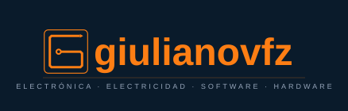

# Hola soy Giuliano Viacava F. ⚡

  

Soy ingeniero eléctrico y programador, me enfoco en el desarrollo de software con `Python` y lo relaciono con hardware de distintas placas de desarrollo Raspberry Pi o ESP32, estas utilizan el lenguaje de programación `MicroPython`. 

 

# Repositorios de libre acceso

- [Seacinforme:](https://github.com/Giulianovfz/seacinforme) Software de escritorio que permite crear informes de aseguramiento de calidad de software, el cual tiene una plantilla cargada.
- [Información y ejercicios con framework Pandas.](https://github.com/Giulianovfz/informacion-y-ejercicios-con-pandas)

 

# Lenguajes y Herramientas:

